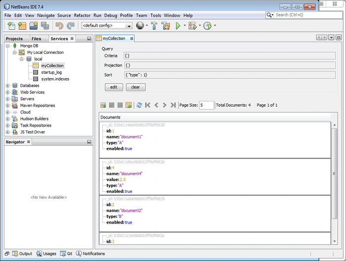

NetBeans MongoDB
================

A [NetBeans](http://netbeans.org) plugin for accessing [MongoDB](http://mongodb.org). It adds
a node to the Services tab. Right click it to add connections.

Available main features:
 * Connect to MongoDB using mongo standard uri
 * Browse collections
 * Create/Rename/Delete collections
 * Browse documents (json criteria/projection/sort can be specified)
 * Add/Edit/Delete documents as json
 * Import/Export json
 * Open a [mongo shell](https://github.com/le-yams/netbeans-mongodb/wiki/MongoShell) for configured connection (mongo executable path must be configured in options)

See [release notes](https://github.com/le-yams/netbeans-mongodb/wiki/ReleaseNotes) for more informations.

Get and Install
---------------

The latest release is available at the netbeans plugin portal, you can download it [here](http://plugins.netbeans.org/plugin/52638/nbmongo)

If you want to try the development version, as it's a Maven project built using the NBM Maven Plugin, just check out and build.
In NetBeans, install using Tools | Plugins on the Downloaded tab.

License
-------
MIT license
